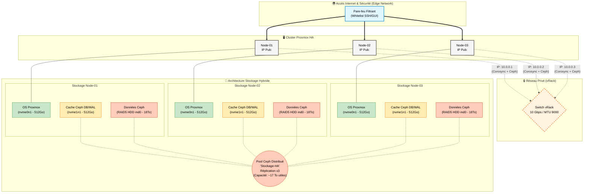

# 🚀 Déploiement d'un Cluster Proxmox VE Haute Disponibilité (HA) & Ceph sur OVHcloud

## 📌 1. Contexte et Objectifs
L'objectif de ce projet est de déployer une infrastructure hyper-convergée offrant une **Haute Disponibilité (HA)** des machines virtuelles. En cas de panne matérielle d'un nœud, les instances hébergées redémarrent automatiquement sur les nœuds sains, sans intervention humaine ni perte de données, grâce au stockage distribué Ceph.

## 🖥️ 2. Inventaire de l'Infrastructure

L'infrastructure repose sur un cluster de 3 serveurs dédiés (Bare Metal).

| Nœud | Rôle | IP Publique | IP Privée (vRack) | Utilisateur |
| :--- | :--- | :--- | :--- | :--- |
| **Node-01** | Master / OSD / Mon | `<IP_PUB_NODE_1>` | `10.0.0.1` | `root` |
| **Node-02** | Hôte / OSD / Mon | `<IP_PUB_NODE_2>` | `10.0.0.2` | `root` |
| **Node-03** | Hôte / OSD / Mon | `<IP_PUB_NODE_3>` | `10.0.0.3` | `root` |

### Architecture de Stockage (Identique sur chaque Node)
Pour optimiser la volumétrie tout en maintenant des performances IOPS élevées sur des disques mécaniques, une **architecture hybride NVMe/HDD** a été déployée :
* `/dev/nvme0n1` (512 Go) ➔ OS Proxmox VE.
* `/dev/nvme1n1` (512 Go) ➔ 100% dédié au cache Ceph (DB/WAL BlueStore) pour accélérer les écritures.
* `/dev/sda, sdb, sdc, sdd` (4x 6 To HDD) ➔ RAID 5 Logiciel (`mdadm`) ➔ Forme 1 unique OSD Ceph par serveur.
* **Capacité totale du cluster :** ~51 TiB brut / ~17 TiB utilisable (Réplication x3).

---

## 🔒 3. Prérequis et Sécurité

1. **Désactivation du Monitoring :** Configuré sur "sans intervention proactive" côté hébergeur pour permettre les tests de bascule (Crash-tests) sans déclencher d'incidents matériels.
2. **Edge Network Firewall :** Bloqué par défaut (DROP). Seuls les accès SSH administrateurs (port 22) et l'accès GUI (port 8006) sont autorisés en entrée publique. Les flux inter-nœuds sont whitelistés sur toutes les interfaces.

*Exemple de règles appliquées (Node-01) :*
| Priorité | Action | Protocole | IP Source | Port Dest. | Usage |
| :--- | :--- | :--- | :--- | :--- | :--- |
| 0 | Autoriser | TCP | `0.0.0.0/0` | `8006` | Interface GUI Proxmox |
| 1-4 | Autoriser | TCP | `<IPs_ADMIN>` | `22` | Accès SSH Administrateurs |
| 5-6 | Autoriser | IPv4 | `<IP_NODE_02_&_03>` | *any* | Inter-nœuds (Cluster/Ceph) |
| 19 | Refuser | IPv4 | `0.0.0.0/0` | *any* | **DROP TOTAL** |

---

## 🌐 4. Configuration Réseau Privé (vRack)

Un réseau privé virtuel (vRack) isole le trafic de synchronisation du cluster (Corosync) et la réplication des données (Ceph). Le **MTU est fixé à 9000** (Jumbo Frames) pour maximiser les performances de stockage.

*Fichier `/etc/network/interfaces` :*
```bash
auto enp1s0f1
iface enp1s0f1 manual
    mtu 9000

auto vmbr1
iface vmbr1 inet static
    address 10.0.0.X/24
    bridge-ports enp1s0f1
    bridge-stp off
    bridge-fd 0
    mtu 9000
```

🔗 5. Création du Cluster Proxmox

Création du cluster (cluster-pve-ha) via l'interface GUI en utilisant exclusivement les adresses IP privées (Réseau 10.0.0.0/24) pour le Cluster Network (Link 0) afin de garantir la stabilité de Corosync face aux perturbations du réseau public.
💽 6. Implémentation du Stockage Ceph (Hybride RAID5/NVMe)
6.1. Initialisation Ceph

Installation des paquets sur les 3 nœuds (Réseaux Public/Cluster : 10.0.0.0/24). Création des Monitors (Mon) et Managers (Mgr) pour assurer le Quorum.
6.2. Préparation du RAID 5 Logiciel (mdadm)

L'agrégation des disques mécaniques (HDD) se fait via mdadm sur chaque serveur :
Bash

apt update && apt install mdadm -y
mdadm --create /dev/md0 --level=5 --raid-devices=4 /dev/sda /dev/sdb /dev/sdc /dev/sdd

# Persistance au boot
mdadm --detail --scan >> /etc/mdadm/mdadm.conf
update-initramfs -u

6.3. Authentification Ceph-Volume
Génération du Keyring autorisant la création manuelle des OSD :
Bash

mkdir -p /var/lib/ceph/bootstrap-osd
ceph auth get client.bootstrap-osd > /var/lib/ceph/bootstrap-osd/ceph.keyring
ceph auth get client.bootstrap-osd > /etc/pve/priv/ceph.client.bootstrap-osd.keyring

6.4. Création des OSD (LVM + Cache NVMe BlueStore)

ceph-volume nécessitant une couche logique pour exploiter un volume RAID logiciel, un espace LVM est créé. Le second disque NVMe (nvme1n1) y est rattaché en tant que Block DB pour absorber les écritures aléatoires et compenser la latence du RAID 5 HDD :
Bash

# Création de la couche LVM sur le RAID 5
pvcreate /dev/md0
vgcreate ceph-raid /dev/md0
lvcreate -l 100%FREE -n osd ceph-raid

# Instanciation de l'OSD avec accélération NVMe
ceph-volume lvm create --data ceph-raid/osd --block.db /dev/nvme1n1

6.5. Création du Pool de Réplication

Création du pool Stockage-HA (Size: 3, Min Size: 2, PG Autoscale: On) et activation de l'option "Add as Storage" dans Proxmox.
🛡️ 7. Mise en place de la Haute Disponibilité (HA)

    Création du Groupe HA : Ajout des 3 nœuds dans un groupe défini (Cluster-Prod).

    Protection d'une VM : Assignation d'une machine virtuelle de test (dont le disque virtuel est stocké sur Stockage-HA) à ce groupe pour activer le Fencing.

✅ 8. Validation et État Cible
8.1. Vérifications de l'état du cluster
Bash

ceph -s              # Santé globale (Doit retourner HEALTH_OK)
cat /proc/mdstat     # État de synchronisation du RAID 5 (State: clean [UUUU])
pvesm status         # Validité des stockages Proxmox

8.2. Crash Test (Basculement HA)

Simulation d'une perte de nœud brutale (Kernel Panic déclenché via echo c > /proc/sysrq-trigger).

    Résultat : Le Watchdog matériel isole le nœud défaillant. Le gestionnaire HA détecte l'anomalie, attend l'expiration du verrou de sécurité, et redémarre automatiquement la machine virtuelle sur un nœud sain en moins de 2 minutes. Validation totale du PoC.

🗺️ 9. Schéma d'Architecture Logique


